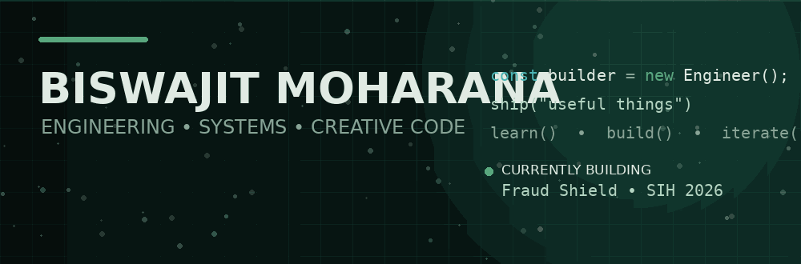
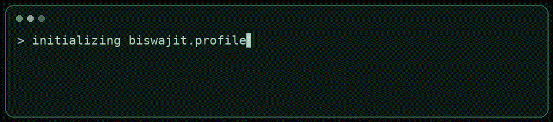

<div align="center">



<br>

### I build things to understand them.

**Computer Science student · Java + JavaScript · DSA · Web Development**

<br>

[](https://github.com/bbxbiswajit)
[](https://github.com/bbxbiswajit)

</div>

---

## `01 / CURRENT STATE`

```text
┌───────────────────────────────────────────────────────────────┐
│ BUILDING        Fraud Shield — explainable fintech security  │
│ LEARNING        DSA • Java • JavaScript • full-stack systems  │
│ EXPLORING       backend architecture • ML • system thinking  │
│ APPROACH        first principles > memorizing syntax         │
└───────────────────────────────────────────────────────────────┘
```

<div align="center">

</div>

---

## `02 / WHAT I WORK WITH`

| Core | Web | Tools |
|:---|:---|:---|
| Java · JavaScript | HTML · CSS | Git · GitHub · VS Code |
| Arrays · Strings · DSA | Node.js · Express | IntelliJ IDEA |
| OOP · Recursion | MongoDB · SQL | Linux / Windows |

### `currently learning`
**Java + DSA → deeper JavaScript → full-stack development → CS fundamentals**

---

## `03 / FEATURED BUILDS`

### 🛡️ Fraud Shield
**Explainable real-time fraud protection for UPI-style payments.**

Risk scoring · behavioural signals · device/location checks · social-engineering indicators · explainable decisions.

> **Goal:** make a security system understandable to the person it protects.

[View project →](https://github.com/bbxbiswajit/fraud-shield-frontend)

---

## `04 / ENGINEERING MINDSET`

> I don't want to merely know **how** something works.  
> I want to know **why** it works.

That means:

- understanding fundamentals before frameworks
- solving problems before searching for solutions
- building projects that force me to learn
- writing code I can explain, not just code that runs

---

## `05 / THE ROAD AHEAD`

```text
2026
│
├── DSA / Competitive Programming
├── Java deeply
├── Modern Web Development
├── Backend + APIs
├── Computer Science fundamentals
└── Build → break → understand → rebuild
```

---

## `06 / CONNECT`

<div align="center">

<a href="https://github.com/bbxbiswajit">

</a>
<a href="mailto:YOUR_EMAIL_HERE">

</a>

<br><br>

**Thanks for stopping by.**

<i>Keep building. Keep questioning.</i>

</div>
